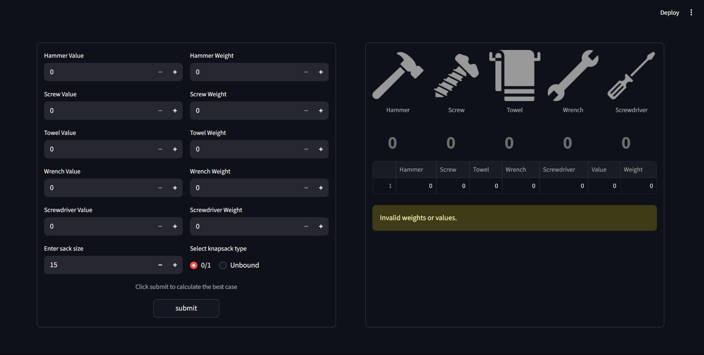
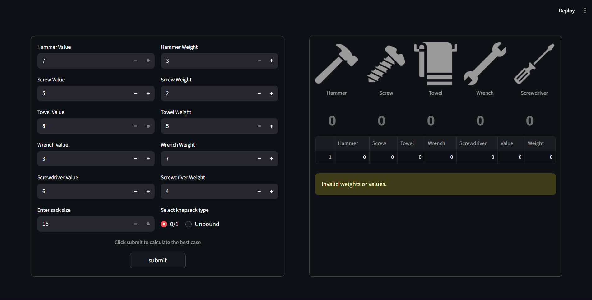
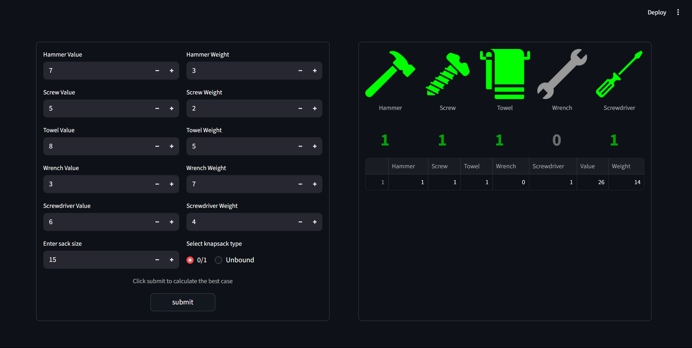
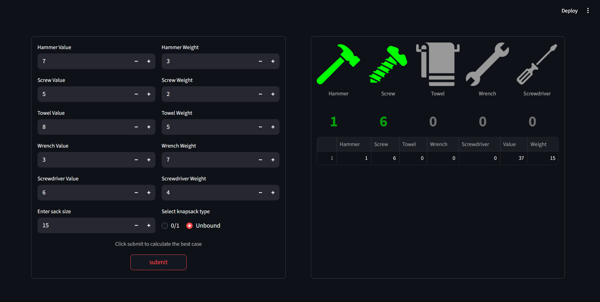

# Knapsack Optimization App



## Overview
This project is a Streamlit-based web application that solves a knapsack optimization problem using mixed-integer programming with the GEKKO optimization library. Users can input the values and weights of different items, select a knapsack type (0/1 or unbound), and visualize the best combination of items to maximize value within a given weight limit.

The project is split into two main files:
- **Knap_funcs.py**: Contains the core logic for handling inputs, solving the optimization problem, and visualizing the results.
- **Knap.py**: The main script that sets up the Streamlit app and calls functions from `Knap_funcs.py`.


## Features
- **User Input Interface**: Allows users to input the values and weights of five different items (Hammer, Screw, Towel, Wrench, Screwdriver).
- **Knapsack Types**: Users can choose between two types of knapsack problems:
  - **0/1 Knapsack**: Items can either be included or excluded.
  - **Unbound Knapsack**: Items can be included multiple times.
- **Mixed-Integer Optimization**: Utilizes the GEKKO library to solve the knapsack problem efficiently.
- **Visualization**: Displays the selected items and their quantities using images, along with the total value and weight of the selected items.


## How to Run the App
1. **Clone the repository** to your local machine:
   ```bash
   git clone https://github.com/GuechtouliAnis/Knapsack
   ```
2. **Navigate to the project directory**:
   ```bash
   cd Knapsack
   ```
3. **Install the required dependencies**:
   ```bash
   pip install -r requirements.txt
   ```
4. **Run the Streamlit app**:
   ```bash
   streamlit run Knap.py
   ```


## Files Description
### 1. `Knap_funcs.py`
This file contains the core functions used in the app:
- **`get_values(values)`**: Collects user inputs for item values.
- **`get_weights(weights)`**: Collects user inputs for item weights.
- **`mix_int(v, w, y, limit, o)`**: Solves the mixed-integer optimization problem using the GEKKO library.
- **`get_state(item, df)`**: Determines whether an item is included in the solution and sets its display color.
- **`visualize(df)`**: Displays the selected items and their quantities using images.
- **`mixedInt(y)`**: Main function that orchestrates the input collection, optimization, and visualization processes.

### 2. `Knap.py`
This is the main script that sets up the Streamlit interface and calls the functions from `Knap_funcs.py`.
- **`st.set_page_config()`**: Configures the Streamlit app's title, icon, and layout.
- **`kf.mixedInt(y)`**: Calls the `mixedInt()` function from `Knap_funcs.py` to start the optimization process.


## Dependencies
- **Streamlit**: For building the web interface.
- **Pandas**: For handling tabular data.
- **NumPy**: For numerical computations.
- **GEKKO**: For solving the mixed-integer optimization problem.

Install the dependencies using:
```bash
pip install -r requirements.txt
```

## Example Use Case
**Scenario**: You have a sack with a weight limit of 15 units. You need to decide which items (Hammer, Screw, Towel, Wrench, Screwdriver) to pack to maximize the value without exceeding the weight limit.

1. **Input Values and Weights**: Input values and weights for the items in the app.

2. **Select Knapsack Type**: Choose between the 0/1 knapsack or unbound knapsack type.



3. **Solve the Problem**: The app uses GEKKO to solve the optimization problem.

4. **Visualize the Solution**: The app displays the selected items and their quantities using images.

5. **View the DataFrame**: The app displays a DataFrame containing the solution details, including the total value and weight.

Binary Knapsack solution


Unbound Knapsack solution


## License
This project is licensed under the MIT License. Feel free to use, modify, and distribute the code as needed.


## Author
Anis Guechtouli

## Contact
For any questions or suggestions, feel free to contact me at [guechtoulianiss7@gmail.com].